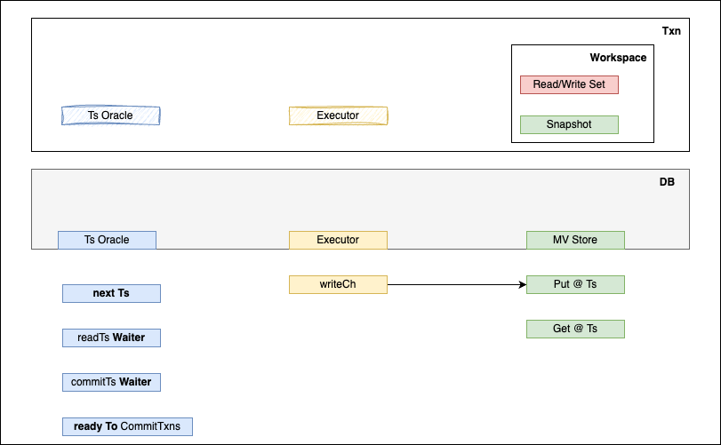

# Tiny Txn

In this project we try to implement `Serializable Snapshot Isolation` from Badger.

- Scheduler + Executor: Responsible for `serialazable`
- MV Store: Responsible for `snapshot`
- Read/Write Set + Snapshot (ie Workspace): Responsible for `isolation`

### References
- [serialized_snapshot_isolation](https://github.com/SarthakMakhija/serialized-snapshot-isolation/blob/47716fb70cf0f1d563b599ff7fef4086581364ff/mvcc/Memtable.go#L9)
- [badger](https://github.com/dgraph-io/badger/blob/7b5baa11879cdf9d8608fc77ae3033c30a68b972/txn.go#L46)
- [gaeadb](https://github.com/infinivision/gaeadb/blob/d4277921708dfdd3e34cb071a5c6f73128133e31/transaction/transaction.go#L18)
- [icecanedb](https://github.com/dr0pdb/icecanedb/blob/344bb713ed76cd931610867523d14ab80d68236b/pkg/inmemory-mvcc/transaction.go#L24)
- [Apache Omid](https://www.usenix.org/system/files/conference/fast17/fast17-shacham.pdf)
- [MatrixOrigin](https://github.com/arjunsk/matrixone/blob/c80e5add3048e656aac805ae6849d724cb0309dd/pkg/txn/client/types.go#L173)
- [Serializable Snapshot Isolation Paper](https://github.com/db-modules/awesome-dbdev/blob/master/papers/serializable-snapshot-isolation.pdf)
- [Write Snapshot Isolation Paper](https://github.com/dbminions/awesome-dbdev/blob/master/papers/write-snapshot-isolation.pdf)
